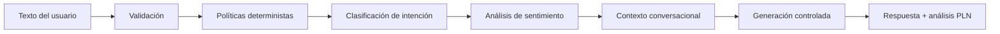
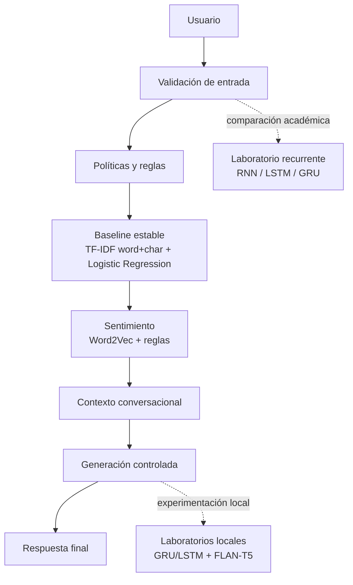

# Sképsis Assistant

### Asistente inteligente para orientación tecnológica, clasificación de intención, análisis de sentimiento y respuesta controlada

Aplicación web desarrollada en Python y Streamlit para orientar consultas sobre IA aplicada, ciencia de datos, automatización, aplicaciones empresariales, dashboards, APIs, metodología y contacto de Sképsis Apps. El proyecto integra un enfoque híbrido de PLN clásico, Deep Learning recurrente, embeddings, análisis de sentimiento, generación controlada y laboratorios experimentales locales.

**Instituto Internacional de Aguascalientes**  
Maestría en Inteligencia Artificial para la Transformación Digital · Aprendizaje Profundo

**Repositorio:** https://github.com/edtech-mx-ve/skepsis.chatbot  
**Sitio de Sképsis Apps:** https://skepsis-apps.github.io/landing_page/  
**Aplicación pública:** https://skepsis-chatbot.streamlit.app/

---

## Estado del proyecto

Sképsis Assistant se encuentra funcional y validada localmente.

La versión Cloud Lite conserva los componentes estables necesarios para despliegue web y omite deliberadamente los modelos pesados de laboratorio. La versión local completa mantiene además RNN/LSTM/GRU, generación neuronal y FLAN-T5 local.

**Versión actual:** `0.8.7`  
**Estado del despliegue público:** activo en Streamlit Community Cloud.  
**URL pública:** https://skepsis-chatbot.streamlit.app/

La aplicación web utiliza directamente los artefactos ya entrenados; no es necesario reentrenar los modelos para usar la interfaz.

---

## ¿Qué hace Sképsis Assistant?

La aplicación recibe texto libre del usuario y lo procesa para ofrecer una orientación técnica breve dentro del dominio de Sképsis Apps.

Puede:

- detectar la intención principal del mensaje;
- identificar consultas sobre automatización, ciencia de datos, IA aplicada, aplicaciones, metodología, servicios y contacto;
- reconocer facetas técnicas de aprendizaje profundo y razonamiento inteligente sin crear nuevas clases principales;
- mantener contexto conversacional en seguimientos como `Cuéntame más`;
- estimar sentimiento como positivo, neutral o negativo;
- responder con generación controlada basada en conocimiento aprobado;
- formular preguntas diagnósticas específicas según la faceta detectada;
- distinguir servicio estable, capacidad de prototipado y casos que requieren validación específica;
- detectar consultas fuera de dominio;
- mostrar análisis PLN opcional con intención, faceta, madurez, confianza y sentimiento;
- ofrecer información didáctica sobre modelo, evaluación, ayuda, trivia y glosario;
- mantener una versión Cloud Lite sin dependencias neuronales pesadas;
- conservar laboratorios locales de RNN/LSTM/GRU, embeddings, generación neuronal y Hugging Face.

> **Importante:** Sképsis Assistant no es un asistente universal. Su alcance está limitado al dominio tecnológico definido para Sképsis Apps. Las salidas deben interpretarse como orientación preliminar, no como una decisión profesional de alto impacto.

---

## Sprint 8 — atención ampliada por facetas

La versión `0.8.7` conserva las **12 intenciones principales** y añade una segunda capa determinista de facetas. No se reentrenó el baseline de intención.

```text
mensaje
  ↓
intención principal
  ↓
faceta de servicio
  ↓
nivel de madurez
  ↓
pregunta diagnóstica
  ↓
respuesta controlada
```

Capacidades incorporadas en esta capa:

- aprendizaje profundo;
- visión por computadora;
- PLN con aprendizaje profundo;
- RNN / LSTM / GRU;
- transfer learning;
- optimización de modelos;
- representación del conocimiento;
- sistemas basados en reglas;
- búsqueda heurística;
- planificación automática / STRIPS;
- razonamiento basado en casos (CBR);
- apoyo explicable a decisiones.

Las capacidades avanzadas se presentan como **capacidad técnica y prototipado**. Los casos de alto impacto, biometría productiva, control físico crítico o autonomía sin supervisión requieren validación específica antes de asumir alcance.

---

## Flujo general de inferencia



En forma compacta:

```text
Texto
→ validación
→ políticas
→ intención
→ sentimiento
→ contexto
→ generación controlada
→ respuesta
```

---

## Arquitectura didáctica del sistema

Sképsis Assistant utiliza una arquitectura híbrida.



### Configuración principal

| Componente | Implementación |
|---|---|
| Lenguaje | Python 3.11 |
| Interfaz | Streamlit |
| Problema principal | Clasificación multiclase de intención |
| Clases de intención | 12 |
| Baseline productivo | TF-IDF word+char + Logistic Regression |
| Deep Learning recurrente | RNN, LSTM y GRU en PyTorch |
| Recurrente seleccionado | LSTM |
| Sentimiento | Word2Vec + Logistic Regression + reglas |
| Embeddings comparados | Word2Vec y GloVe |
| Generación oficial | Controlada, basada en conocimiento aprobado |
| Generación neuronal experimental | LSTM y GRU |
| Hugging Face experimental | `google/flan-t5-small` local |
| Despliegue público | https://skepsis-chatbot.streamlit.app/ |
| Semilla principal | `42` |

---

## ¿Cómo aprende el componente recurrente?

El laboratorio recurrente transforma texto tokenizado en secuencias y aprende representaciones mediante embeddings y estados recurrentes.

```text
Texto
  ↓
tokenización
  ↓
vocabulario
  ↓
embeddings
  ↓
RNN / LSTM / GRU
  ↓
representación secuencial
  ↓
capa de clasificación
  ↓
12 intenciones
```

Se compararon RNN, LSTM y GRU usando los mismos splits congelados y varias semillas. La selección se realizó con métricas de validación, evitando usar el conjunto de prueba para escoger arquitectura.

---

## Integración tecnológica implementada

| Capa | Tecnología / artefacto | Responsabilidad |
|---|---|---|
| Interfaz | Streamlit | Conversación, configuración, ayuda y visualización |
| Validación | Python | Longitud, caracteres y entradas no confiables |
| Intención | scikit-learn | TF-IDF + Logistic Regression |
| Deep Learning | PyTorch | RNN, LSTM, GRU y generación neuronal |
| Embeddings | Gensim / PyTorch | Word2Vec y GloVe |
| Sentimiento | scikit-learn + embeddings | Positivo, neutral y negativo |
| Contexto | Python | Continuidad entre turnos |
| Generación | Python | Respuesta controlada |
| Hugging Face | Transformers | Laboratorio FLAN-T5 local |
| Evaluación | scikit-learn / pytest | Métricas, regresiones y robustez |
| Versionado | Git / GitHub | Código y artefactos esenciales |
| Despliegue | Streamlit Community Cloud | Ejecución pública Cloud Lite |

---

## Dataset de intención

El dataset congelado contiene:

| Elemento | Valor |
|---|---:|
| Ejemplos | 795 |
| Intenciones | 12 |
| Train | 556 |
| Validation | 119 |
| Test | 120 |
| Semilla | 42 |

Las 12 clases son:

`aplicaciones_empresariales` · `automatizacion` · `ciencia_datos` · `consultoria` · `contacto` · `despedida` · `fuera_dominio` · `ia_aplicada` · `metodologia` · `saludo` · `servicios` · `tecnologias`

> El dataset es especializado y contiene ejemplos sintéticos diseñados para el dominio del proyecto. Por ello, las métricas deben interpretarse dentro de ese contexto.

---

## Evaluación del baseline de intención

| Métrica | Validación | Test |
|---|---:|---:|
| Accuracy | 0.9748 | 0.9750 |
| Precision macro | 0.9765 | 0.9741 |
| Recall macro | 0.9731 | 0.9731 |
| Macro-F1 | 0.9744 | 0.9727 |

El baseline permanece como motor estable porque obtuvo mejor desempeño que los recurrentes experimentales sobre el mismo problema.

---

## Comparación recurrente RNN / LSTM / GRU

Resultados medios de validación registrados durante el Sprint 3:

| Arquitectura | Macro-F1 validación |
|---|---:|
| RNN | 0.8438 ± 0.0167 |
| LSTM | 0.9452 ± 0.0110 |
| GRU | 0.9097 ± 0.0172 |

Modelo recurrente seleccionado: **LSTM**, semilla `42`.

### Resultado LSTM seleccionado en test

| Métrica | Resultado |
|---|---:|
| Accuracy | 0.8833 |
| Precision macro | 0.9005 |
| Recall macro | 0.8890 |
| Macro-F1 | 0.8901 |
| Latencia por ejemplo | 0.0363 ms |
| Tamaño del modelo | 185.2 KB |

La LSTM se conserva como comparación académica y no sustituye al baseline estable.

---

## Embeddings y análisis de sentimiento

Se compararon Word2Vec y GloVe.

| Embedding | Macro-F1 validación |
|---|---:|
| Word2Vec | 1.0000 |
| GloVe | 0.9815 |

Embedding seleccionado: **Word2Vec**.

### Sentimiento

| Evaluación | Resultado |
|---|---:|
| Test macro-F1 | 1.0000 |
| Evaluación externa raw | 26/30 |
| Evaluación externa híbrida | 30/30 |

El sistema híbrido añade reglas de alta precisión para corregir expresiones informativas, predictivas y de seguimiento conversacional.

---

## Generación de texto

La respuesta oficial del chatbot utiliza **generación controlada**.

Los modelos generativos neuronales se conservan como laboratorios experimentales.

Modelo neuronal seleccionado: **GRU**.

| Métrica | Resultado |
|---|---:|
| Perplejidad de validación | 3.0709 |
| Accuracy token validación | 0.7395 |
| Perplejidad test | 2.2078 |
| Accuracy token test | 0.7797 |
| Parámetros | 71,611 |

La generación neuronal no se usa para hechos empresariales ni para respuestas productivas.

---

## Hugging Face local

El laboratorio local utiliza:

```text
google/flan-t5-small
```

Características:

- ejecución local;
- sin API de inferencia de pago;
- pesos descargados fuera del repositorio;
- `local_files_only=True` en la aplicación;
- guard de grounding;
- fallback determinista desde conocimiento aprobado;
- laboratorio separado de la respuesta oficial.

Los pesos de FLAN-T5 no se incluyen en el repositorio público.

---

## Funcionalidades de la app

La interfaz Cloud Lite incluye:

| Sección | Función |
|---|---|
| Chat | Recibir consultas y responder dentro del dominio |
| Motor de intención | Mostrar el baseline estable activo |
| Sentimiento | Mostrar Word2Vec activo |
| Análisis PLN | Mostrar intención, confianza y sentimiento |
| Generación | Mostrar generación controlada |
| Privacidad | Explicar el tratamiento de la sesión |
| Ayuda | Explicar cómo usar la app |
| Preguntas sugeridas | 30 preguntas clicables debajo del campo de chat; al seleccionarlas se envían directamente al chatbot |
| Modelo | Resumir baseline, RNN/LSTM/GRU, embeddings y generación |
| Evaluación | Resumir métricas obtenidas |
| Acerca de | Describir Sképsis Apps y ofrecer contacto |
| Trivia | Explicar el origen griego de Sképsis |
| Glosario | Definir conceptos técnicos de la app |

### Contacto

- Correo: [skepsis.apps@gmail.com](mailto:skepsis.apps@gmail.com)
- WhatsApp México: [+52 55 6574 1576](https://wa.me/525565741576)
- WhatsApp Venezuela: [+58 424 403 55 99](https://wa.me/584244035599)
- Sitio: [Sképsis Apps](https://skepsis-apps.github.io/landing_page/)

---

## Ayuda — flujo de uso

```text
Escribir necesidad
→ enviar
→ revisar respuesta
→ activar análisis PLN si se desea
→ continuar con una pregunta de seguimiento
```

Ejemplos:

```text
Quiero automatizar reportes de Excel.
Necesito analizar las ventas de mi empresa.
Quiero predecir la demanda del próximo trimestre.
¿Cómo trabajan?
¿Cuál es el sitio web?
```

---

## Trivia — origen de Sképsis

**Sképsis** proviene del griego **σκέψις (sképsis)**, asociado con examinar, considerar y reflexionar.

El nombre resume la filosofía del producto:

```text
problema
→ observación
→ análisis
→ criterio
→ solución tecnológica
```

---

# Inicio rápido

## Opción A — Ejecutar Cloud Lite localmente

### 1. Clonar el repositorio

```powershell
git clone https://github.com/edtech-mx-ve/skepsis.chatbot.git
cd skepsis.chatbot
```

### 2. Crear entorno virtual con Python 3.11

```powershell
py -3.11 -m venv .venv
```

### 3. Activar el entorno

```powershell
Set-ExecutionPolicy -Scope Process -ExecutionPolicy Bypass
.\.venv\Scripts\Activate.ps1
```

Verificar:

```powershell
python --version
```

Resultado esperado:

```text
Python 3.11.x
```

### 4. Instalar dependencias Cloud Lite

```powershell
python -m pip install --upgrade pip
python -m pip install -r deployment/streamlit/requirements.txt
```

### 5. Ejecutar

```powershell
python -m streamlit run deployment/streamlit/cloud_app.py
```

Abrir:

```text
http://localhost:8501
```

---

# Verificación local

Antes de publicar cambios:

```powershell
& ".\.venv\Scripts\python.exe" -m pytest
& ".\.venv\Scripts\python.exe" -m scripts.check_sprint8_services
& ".\.venv\Scripts\python.exe" -m scripts.check_cloud_lite_sprint7
& ".\.venv\Scripts\python.exe" -m scripts.robustness_sprint7
& ".\.venv\Scripts\python.exe" -m scripts.check_release_sprint8
```

Estado validado de la versión `0.8.7`:

- **216 pruebas automatizadas**;
- facetas Sprint 8: **15/15**;
- Cloud Lite: **11/11**;
- robustez: **0 fallos**;
- fuzz: **100/100**;
- release readiness Sprint 8: **OK**.

---

# Estructura del repositorio público

```text
skepsis.chatbot/
│
├── deployment/
│   └── streamlit/
│       ├── cloud_app.py
│       ├── requirements.txt
│       └── DEPLOY.md
│
├── assets/
│   ├── skepsis-apps-logo.PNG
│   └── Logo_Skepsis-Apps_Simbolo.PNG
│
├── config/
│   └── settings.py
│
├── data/
│   ├── knowledge_base.json
│   ├── service_knowledge_v2.json
│   └── splits/
│
├── artifacts/
│   ├── intent_baseline.joblib
│   └── sprint4/
│       ├── embeddings/
│       └── sentiment/
│
├── src/
│   ├── chatbot.py
│   ├── domain.py
│   ├── knowledge.py
│   ├── validation.py
│   ├── cloud/
│   ├── ml/
│   ├── nlp/
│   ├── services/
│   │   ├── service_knowledge.py
│   │   ├── facet_detector.py
│   │   └── service_response.py
│   └── ui/
│
├── reports/
│   └── sprint7/
│
├── tests/
├── .streamlit/
│   └── config.toml
├── .gitignore
├── README.md
└── requirements.txt
```

No publicar:

```text
.venv/
__pycache__/
.pytest_cache/
.env
.streamlit/secrets.toml
logs/
artifacts/sprint6/huggingface/flan-t5-small/*
artifacts/sprint6/huggingface/_download_cache/
*.zip
```

---

# GitHub — primera publicación

Repositorio:

```text
https://github.com/edtech-mx-ve/skepsis.chatbot
```

Desde la carpeta local:

```powershell
git init
git branch -M main
git remote add origin https://github.com/edtech-mx-ve/skepsis.chatbot.git
git status
```

Agregar los componentes del proyecto:

```powershell
git add README.md .gitignore requirements.txt pyproject.toml
git add .streamlit
git add deployment
git add assets
git add config
git add data
git add src
git add artifacts
git add reports
git add tests
```

Revisar:

```powershell
git status
```

Después:

```powershell
git commit -m "Initial release Sképsis Assistant"
git push -u origin main
```

> Evita `git add .` hasta confirmar que `.gitignore` está excluyendo correctamente `.venv`, caches y pesos locales de FLAN-T5.

---

# Actualizar GitHub

Después de realizar cambios y probar:

```powershell
python -m pytest
git status
git add <archivos_modificados>
git commit -m "Describe el cambio realizado"
git push
```

---

# Despliegue en Streamlit Community Cloud

**Estado:** despliegue público activo.  
**Aplicación:** https://skepsis-chatbot.streamlit.app/

Configuración preparada:

| Campo | Valor |
|---|---|
| Repositorio | `edtech-mx-ve/skepsis.chatbot` |
| Rama | `main` |
| Main file path | `deployment/streamlit/cloud_app.py` |
| Python | `3.11` |
| Secrets | No requeridos |

Pasos:

1. Ir a https://share.streamlit.io/
2. Iniciar sesión con GitHub.
3. Seleccionar **Create app**.
4. Elegir `edtech-mx-ve/skepsis.chatbot`.
5. Seleccionar la rama `main`.
6. Usar `deployment/streamlit/cloud_app.py` como archivo principal.
7. En **Advanced settings**, seleccionar Python 3.11.
8. No agregar secrets.
9. Pulsar **Deploy**.
10. Validar intención, sentimiento, contexto, links de contacto y navegación.

---

# Seguridad y robustez

Sképsis Assistant incorpora:

- validación de entrada;
- longitud máxima de mensaje;
- eliminación de caracteres de control;
- tratamiento de HTML, SQL, rutas y bloques de código como texto;
- reglas deterministas para casos de alta confianza;
- manejo controlado de errores;
- historial de interfaz limitado;
- contexto conversacional acotado;
- texto del usuario excluido de logs;
- `.gitignore` para secretos, entorno virtual y pesos grandes;
- artefactos HF fuera del repositorio;
- pruebas adversariales deterministas;
- fuzz reproducible;
- generación oficial limitada a conocimiento aprobado;
- grounding y fallback en el laboratorio HF.

---

# Solución de problemas

### PowerShell bloquea el entorno virtual

```powershell
Set-ExecutionPolicy -Scope Process -ExecutionPolicy Bypass
.\.venv\Scripts\Activate.ps1
```

### Se usa Python 3.12 global por error

Ejecutar explícitamente el Python del proyecto:

```powershell
& ".\.venv\Scripts\python.exe" --version
& ".\.venv\Scripts\python.exe" -m streamlit run deployment/streamlit/cloud_app.py
```

### Puerto 8501 ocupado

```powershell
& ".\.venv\Scripts\python.exe" -m streamlit run deployment/streamlit/cloud_app.py --server.port 8502
```

### Falta el baseline

Verificar:

```powershell
Get-ChildItem .\artifacts\intent_baseline.joblib
```

### Falta Word2Vec o sentimiento

Verificar:

```powershell
Get-ChildItem .\artifacts\sprint4\embeddings
Get-ChildItem .\artifacts\sprint4\sentiment
```

### El release checker detecta archivos locales grandes

Ejecutar:

```powershell
python -m scripts.check_release_sprint7
```

Los archivos bajo `.venv/` y los pesos locales de FLAN-T5 deben aparecer como excluidos, no como bloqueantes.

---

# Limitaciones

- El dataset de intención es pequeño y especializado.
- Parte del dataset es sintético.
- Las métricas pueden ser optimistas frente a lenguaje real más variado.
- La LSTM recurrente no superó al baseline clásico.
- El sentimiento se entrenó con un dataset pequeño y balanceado.
- Los embeddings reflejan un corpus de dominio reducido.
- La generación neuronal puede repetir o producir frases incompletas.
- FLAN-T5 puede requerir guard de grounding y fallback.
- Cloud Lite omite deliberadamente modelos pesados para proteger recursos.
- La aplicación es un demostrador académico/profesional de orientación y no debe utilizarse como sistema autónomo para decisiones de alto impacto.

---

# Autoría

**Antonio Nicolás Toro González**  
Maestría en Inteligencia Artificial para la Transformación Digital  
Instituto Internacional de Aguascalientes

Tutora: **Dra. Claudia Andrea Vidales Basurto**

---

# Enlaces

- Repositorio: https://github.com/edtech-mx-ve/skepsis.chatbot
- Sképsis Apps: https://skepsis-apps.github.io/landing_page/
- Aplicación pública: https://skepsis-chatbot.streamlit.app/
- Streamlit Community Cloud: https://share.streamlit.io/
- Institución: https://www.iinternacional.edu.mx/

---

### Sképsis Assistant

```text
Texto
→ intención
→ sentimiento
→ contexto
→ generación controlada
→ orientación tecnológica
```

Aplicación académica de Deep Learning y PLN aplicada a orientación tecnológica.

### Política de contacto y acciones

- Las preguntas exclusivas por el sitio web devuelven el enlace oficial de forma concisa.
- Las consultas compuestas de contacto + sitio devuelven correo, WhatsApp y sitio oficial.
- Solicitudes como `Envíame un correo` no simulan una acción inexistente: la app indica que no puede enviar correos y ofrece el enlace `mailto:` disponible.
