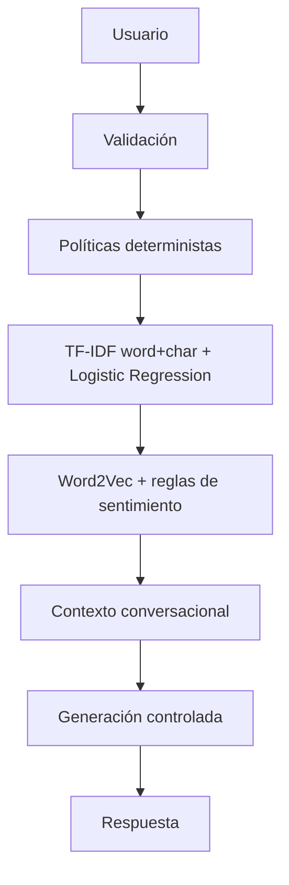

# Sképsis Assistant

### Asistente inteligente para orientación tecnológica, PLN y Deep Learning aplicado

Aplicación académica desarrollada en **Python + Streamlit** para orientar consultas sobre IA aplicada, ciencia de datos, automatización, aplicaciones empresariales, dashboards, APIs, metodología y contacto de **Sképsis Apps**.

**Repositorio académico:** https://github.com/edtech-mx-ve/skepsis.chatbot  
**Sképsis Apps:** https://skepsis-apps.github.io/landing_page/  
**Versión:** `0.7.10`

---

## ¿Qué hace la app?

Sképsis Assistant recibe texto libre y ejecuta un pipeline híbrido:

```text
Texto
→ validación
→ políticas
→ clasificación de intención
→ análisis de sentimiento
→ contexto conversacional
→ generación controlada
→ respuesta
```

La versión pública **Cloud Lite** permite:

- clasificar consultas en 12 intenciones;
- analizar sentimiento como positivo, neutral o negativo;
- mantener contexto en seguimientos como `Cuéntame más`;
- responder con conocimiento aprobado de Sképsis Apps;
- detectar consultas fuera de dominio;
- mostrar análisis PLN opcional;
- ofrecer Ayuda, Modelo, Evaluación, Acerca de, Trivia y Glosario.

> La app es un demostrador académico/profesional de orientación tecnológica. No es un asistente universal ni un sistema para decisiones de alto impacto.

---

## Arquitectura



### Componentes estudiados durante el proyecto

| Componente | Uso |
|---|---|
| TF-IDF + Logistic Regression | Motor estable de intención |
| RNN | Comparación experimental |
| LSTM | Mejor recurrente experimental para intención |
| GRU | Comparación recurrente y generación experimental |
| Word2Vec | Embeddings seleccionados para sentimiento |
| GloVe | Comparación de embeddings |
| FLAN-T5-small | Laboratorio local de Hugging Face |
| Generación controlada | Respuesta oficial de la app |

Los laboratorios pesados permanecen fuera del despliegue Cloud Lite para reducir memoria, tamaño de instalación y tiempo de arranque.

---

## Resultados principales

### Clasificación de intención

Dataset especializado:

- **795 ejemplos**
- **12 intenciones**
- train: **556**
- validation: **119**
- test: **120**

Baseline estable en test:

| Métrica | Resultado |
|---|---:|
| Accuracy | 0.9750 |
| Macro-F1 | 0.9727 |

Comparación recurrente media en validación:

| Arquitectura | Macro-F1 |
|---|---:|
| RNN | 0.8438 ± 0.0167 |
| LSTM | 0.9452 ± 0.0110 |
| GRU | 0.9097 ± 0.0172 |

LSTM seleccionada en test:

- accuracy: **0.8833**
- macro-F1: **0.8901**

El baseline clásico permanece como motor productivo porque obtuvo mejor desempeño.

### Sentimiento

- Word2Vec validation macro-F1: **1.0000**
- GloVe validation macro-F1: **0.9815**
- Word2Vec test macro-F1: **1.0000**
- evaluación externa raw: **26/30**
- evaluación externa híbrida: **30/30**

### Generación neuronal experimental

GRU seleccionada:

- validation perplexity: **3.0709**
- test perplexity: **2.2078**
- test token accuracy: **0.7797**

La generación neuronal no se utiliza para las respuestas oficiales.

> Las métricas pertenecen a datasets pequeños y especializados del proyecto; pueden ser optimistas frente a lenguaje real más variado.

---

## Información disponible en la interfaz

La barra lateral incluye:

- **Ayuda:** cómo utilizar la app;
- **Modelo:** arquitectura híbrida y componentes RNN/LSTM/GRU;
- **Evaluación:** resultados principales;
- **Acerca de:** servicios y contacto de Sképsis Apps;
- **Trivia:** origen griego de *Sképsis*;
- **Glosario:** conceptos técnicos de la aplicación.

### Contacto

- Correo: [skepsis.apps@gmail.com](mailto:skepsis.apps@gmail.com)
- WhatsApp México: [+52 55 6574 1576](https://wa.me/525565741576)
- WhatsApp Venezuela: [+58 424 403 55 99](https://wa.me/584244035599)
- Sitio: [Sképsis Apps](https://skepsis-apps.github.io/landing_page/)

---

# Inicio rápido

## Requisitos

- Python **3.11**
- Git
- conexión a Internet únicamente para instalar dependencias

## 1. Clonar

```powershell
git clone https://github.com/edtech-mx-ve/skepsis.chatbot.git
cd skepsis.chatbot
```

## 2. Crear entorno virtual

```powershell
py -3.11 -m venv .venv
```

## 3. Activar

```powershell
Set-ExecutionPolicy -Scope Process -ExecutionPolicy Bypass
.\.venv\Scripts\Activate.ps1
```

## 4. Instalar dependencias Cloud Lite

```powershell
python -m pip install --upgrade pip
python -m pip install -r deployment/streamlit/requirements.txt
```

## 5. Ejecutar

```powershell
python -m streamlit run deployment/streamlit/cloud_app.py
```

Abrir:

```text
http://localhost:8501
```

---

## Estructura mínima del repositorio

Este repositorio académico publica **solo el README y los archivos necesarios para ejecutar Cloud Lite**.

```text
skepsis.chatbot/
│
├── README.md
├── .gitignore
├── .streamlit/
│   └── config.toml
│
├── deployment/
│   └── streamlit/
│       ├── cloud_app.py
│       └── requirements.txt
│
├── assets/
│   ├── skepsis-apps-logo.PNG
│   └── Logo_Skepsis-Apps_Simbolo.PNG
│
├── config/
│   ├── __init__.py
│   └── settings.py
│
├── data/
│   └── knowledge_base.json
│
├── artifacts/
│   ├── intent_baseline.joblib
│   └── sprint4/
│       ├── embeddings/
│       │   └── word2vec.kv
│       └── sentiment/
│           ├── sentiment_model.joblib
│           └── sentiment_metadata.json
│
└── src/
    ├── __init__.py
    ├── chatbot.py
    ├── domain.py
    ├── knowledge.py
    ├── logging_config.py
    ├── text_utils.py
    ├── validation.py
    ├── cloud/
    │   ├── __init__.py
    │   └── sentiment_lite.py
    ├── generation/
    │   ├── __init__.py
    │   └── controlled.py
    ├── ml/
    │   ├── __init__.py
    │   └── intent_classifier.py
    └── ui/
        ├── __init__.py
        └── info_sections.py
```

### No se publica

El material de entrenamiento, experimentación y desarrollo permanece en el entorno académico local:

```text
.venv/
tests/
scripts/
reports/
data/splits/
data/intents.csv
data/sentiment*.csv
artifacts/recurrent/
artifacts/sprint5/
artifacts/sprint6/
modelos FLAN-T5
notebooks
ZIPs
caches
logs
```

Esto mantiene el repositorio pequeño y suficiente para ejecutar la aplicación.

---

# Publicación en GitHub

Desde una carpeta que contenga **únicamente la estructura mínima anterior**:

```powershell
git init
git branch -M main
git remote add origin https://github.com/edtech-mx-ve/skepsis.chatbot.git
git add .
git status
git commit -m "Publish Sképsis Assistant Cloud Lite"
git push -u origin main
```

Antes del commit, `git status` no debe mostrar `.venv`, modelos FLAN-T5, reportes, datasets de entrenamiento ni archivos ZIP.

---

# Despliegue en Streamlit Community Cloud

Configurar:

| Campo | Valor |
|---|---|
| Repository | `edtech-mx-ve/skepsis.chatbot` |
| Branch | `main` |
| Main file path | `deployment/streamlit/cloud_app.py` |
| Python | `3.11` |
| Secrets | No requeridos |

La aplicación utiliza `deployment/streamlit/requirements.txt` como conjunto mínimo de dependencias.

---

## Seguridad y privacidad

Cloud Lite incluye:

- validación de entradas;
- longitud máxima de mensaje;
- tratamiento defensivo de caracteres de control;
- políticas deterministas de alta confianza;
- generación limitada a conocimiento aprobado;
- historial conversacional acotado;
- ausencia de texto del usuario en logs;
- sin secretos ni API keys en el repositorio;
- sin pesos de FLAN-T5 en el despliegue.

---

## Limitaciones

- dataset especializado y parcialmente sintético;
- dominio restringido a Sképsis Apps;
- resultados no necesariamente generalizables a lenguaje abierto;
- modelo recurrente experimental inferior al baseline productivo;
- sentimiento entrenado con corpus pequeño;
- Cloud Lite omite deliberadamente laboratorios neuronales pesados;
- las respuestas son orientación preliminar.

---

## Autoría

**Antonio Nicolás Toro González**  
Maestría en Inteligencia Artificial para la Transformación Digital  
Instituto Internacional de Aguascalientes

Tutora: **Dra. Claudia Andrea Vidales Basurto**

---

## Enlaces

- Repositorio académico: https://github.com/edtech-mx-ve/skepsis.chatbot
- Sképsis Apps: https://skepsis-apps.github.io/landing_page/
- Streamlit Community Cloud: https://share.streamlit.io/
- Instituto Internacional de Aguascalientes: https://www.iinternacional.edu.mx/
